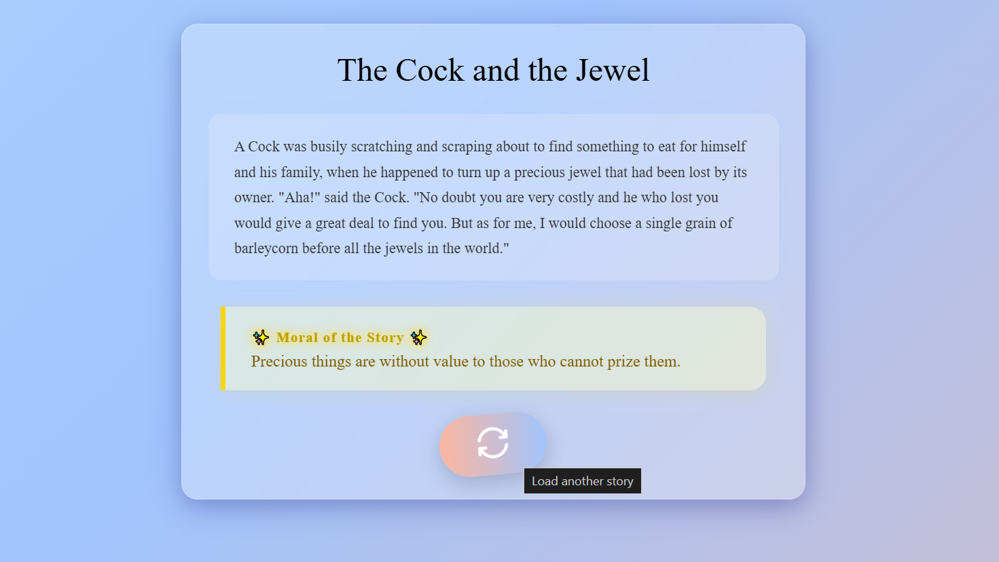

# Moral Stories Web Application

A visually engaging web app that displays random moral stories fetched from a public API. Built with Node.js, Express, and EJS, the app features animated backgrounds, glass-morphism cards, and responsive design.

## Features

- Fetches and displays a random moral story (title, content, and moral)
- Animated gradient background with floating sparkles
- Glassmorphism effect for story cards
- Animated section for "Moral of the Story"
- Refresh button to load a new story instantly
- Responsive design for desktop, tablet, and mobile

## Screenshots

 <!-- Add your screenshot if available -->

## Getting Started

### Prerequisites

- [Node.js](https://nodejs.org/) (v14 or higher recommended)
- npm (comes with Node.js)

### Installation

1. **Clone the repository:**
   ```sh
   git clone https://github.com/ziauddinziya07/Capstone-Project-Moral-Stories-Web-Application.git
   cd moral-stories-webapp
   ```

2. **Install dependencies:**
   ```sh
   npm install
   ```

3. **Start the server:**
   ```sh
   node index.js
   ```

4. **Open your browser and visit:**
   ```
   http://localhost:3000
   ```

## Project Structure

```
Capstone Project: Moral Stories Web Application/
│
├── public/
│   ├── images/
│   │   └── reload.png
│   └── styles/
│       └── main.css
├── views/
│   ├── index.ejs
│   └── partials/
│       ├── header.ejs
│       └── footer.ejs
├── index.js
├── package.json
└── readme.md
```

## Customization

- **Styling:**  
  All custom styles and animations are in `public/styles/main.css`.  
  You can adjust colors, animations, and layout as desired.

## Technologies Used

- Node.js
- Express.js
- EJS (Embedded JavaScript Templates)
- CSS3 (with animations and responsive design)
- [Moral Stories Public API](https://shortstories-api.onrender.com) <!-- Add actual API link if available -->


**Made with ❤️ for SZ, learning and sharing wisdom!**